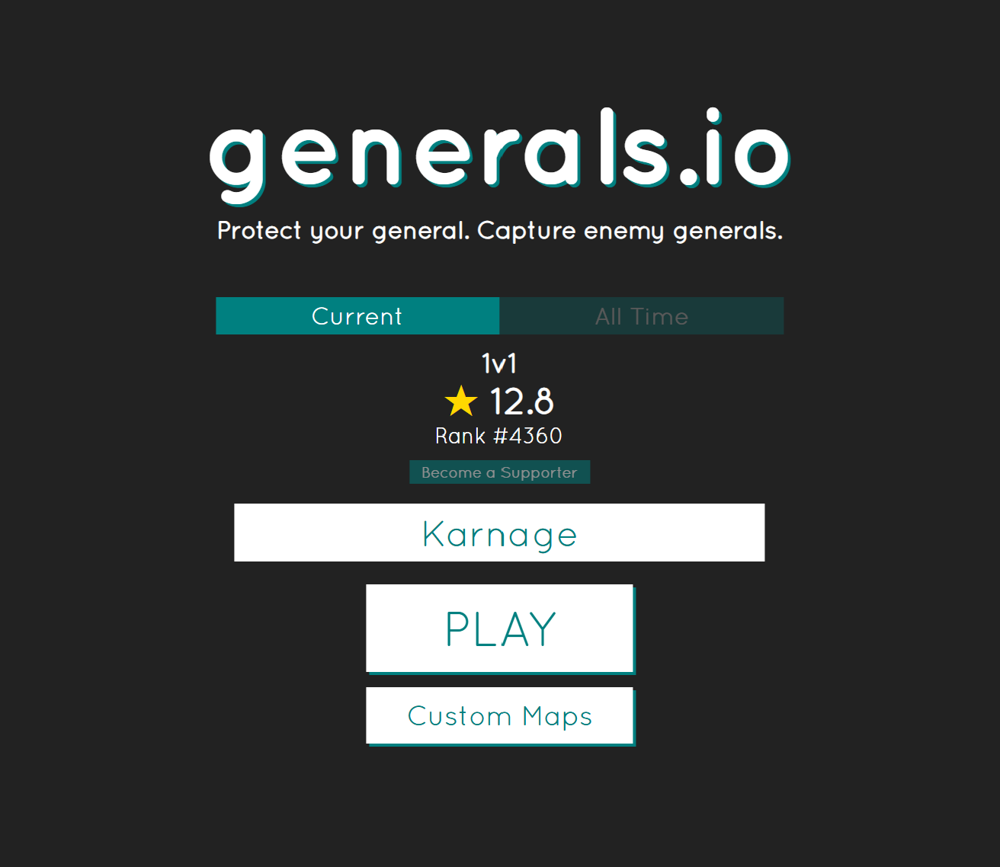
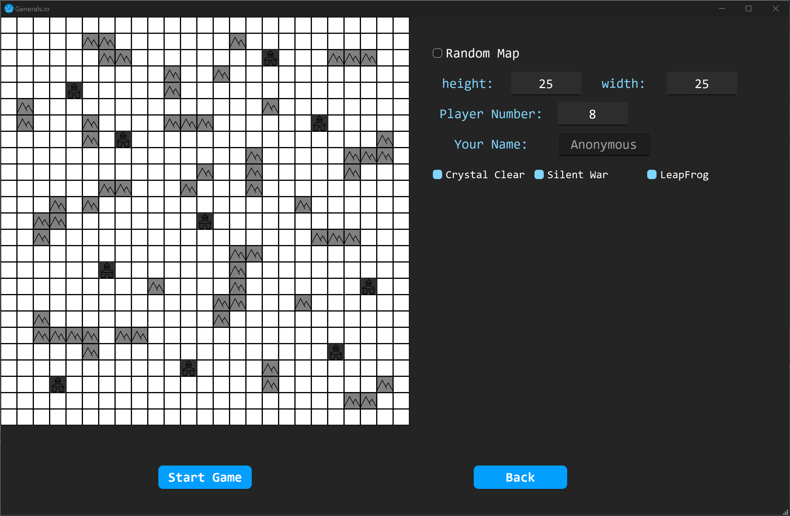
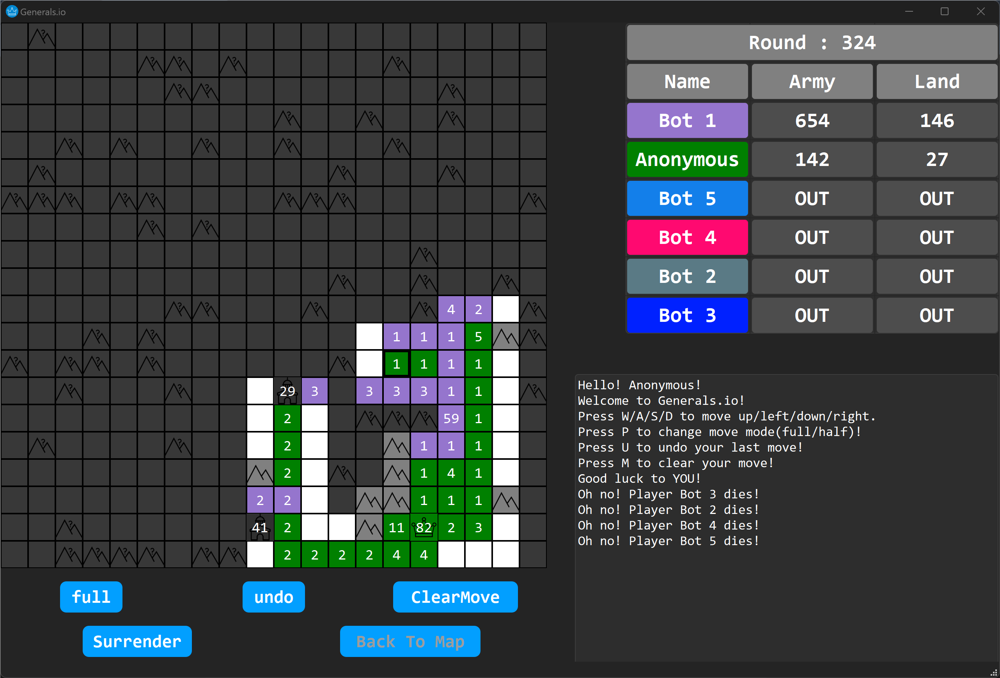

# Generals-io

## 项目介绍

### 项目说明

- 项目名称：将军棋
- 开发小组名称：Generals 组
- 开发小组成员：王造时、胡思远、徐若禺

### 项目简介

本项目是对多人在线策略塔防游戏[将军棋](http://generals.io/)的复刻，玩家可以在本地自定义地图元素、玩家数量与游戏模式，并进行人机对战。游戏结束后，玩家还可以观看对局回放。

  

### 游戏规则简述

#### 游戏地图

游戏在一块大小为 $n \times m$ 棋盘上进行，其中有四种格子：基地、障碍、要塞和空地。
- 基地：每名玩家有一座初始基地，一旦被其他玩家占领，该玩家出局
- 障碍：不可被经过，也不可被占有
- 要塞：初始时不被任何玩家占有且拥有若干兵力，可以被玩家占领，占领后开始产出兵力
- 空地：可以被玩家占领

除了障碍外，每个格子都可以被一名玩家**占有**，玩家所占有的格子中可以驻扎一定单位的**兵力**。

#### 游戏操作与进程

游戏开始时，每名玩家占有一座基地与 1 单位兵力。

游戏以**回合**为单位进行。每个回合，玩家可以移动自己所占有格子中的兵力到相邻格子中。如果目标格子已被该玩家占有，则进行兵力叠加；若不被该玩家占有，则进行兵力抵消，若抵消后该玩家兵力为正，则**占领**目标格子。

若玩家 A 的基地被玩家 B 占领，则玩家 A 立即出局。同时，该基地变为玩家 B 的要塞，该玩家占有的其他所有格子的兵力会减半并归玩家 B 所有。

当场上只剩一名玩家时，游戏结束，该玩家获胜。

#### 兵力产出

每个**游戏回合**开始时，玩家占有的**基地**和**要塞**会产出 1 单位兵力。

每隔 25 个游戏回合（即第 25, 50, 75, ... 回合），玩家占有的**空地**会产出 1 单位兵力。基地和要塞不会叠加产生。

#### 可见信息

每名玩家游戏中可以获得的公开信息如下：
- 当前回合数
- 每名存活玩家的总兵力与占领格子数
- 自己占领的格子上的兵力
- 与自己占领格子八连通的格子状态

对于其他不可见格子，若该格子是障碍物/要塞，则该格子被标记为**不可见的障碍物**，否则被标记为**不可见的空地**。

## 程序说明

### 开始界面

在开始界面中，玩家可以输入自己的昵称，然后点击 `Ready` 按钮开始游戏。由于本项目并没有实现服务器联机对战，因此 `Server Address` 与 `Connect` 按钮并没有实际功能。

  

### 游戏设置界面

在游戏设置界面中，玩家可以对游戏的若干选项进行自定义设置。如果勾选 `Random Map` 选项，则程序会随机生成大小在 16~25 之间的地图；否则，玩家可以手动输入地图大小，并在左侧地图中进行自定义编辑（在单元格中鼠标单击表示要塞，再单击表示障碍）。同时，玩家也可以自己输入 Bot 数量。除此之外，游戏也提供不同模式供玩家选择：

| 模式 | 介绍 |
| --- | --- |
| Misty Veil | 默认模式，地图有战争迷雾（见「游戏规则简述」） |
| Crystal Clear | 移除战争迷雾，地图所有玩家互相可见 |
| Silent War | 移除游戏界面右边的排行榜与公告栏 |
| Leap Frog | 玩家 A 占领玩家 B 基地时，A 的基地迁移至 B |

点击 `Start Game` 按钮后，程序会根据玩家数量随机分配基地，游戏开始。

  

### 游戏界面

游戏界面的左侧为游戏地图，右侧分别是实时排行榜和公告栏，下方为可供鼠标点击的按钮：
| 按钮 | 介绍 |
| --- | --- |
| Full/Half | 表示每次移动调动该格所有/一半兵力 |
| Undo Move | 从移动序列中移除上一次移动 |
| Clear Move | 清空移动序列 |
| Surrender | 投降认输 |
| Back to Map | 游戏结束后，返回设置界面 |
| Replay | 游戏结束后，观看回放 |

Misty Veil 模式

  

Crystal Clear 模式

  

结算界面（Silent War 模式）

  

### 回放界面

进入回放界面后，玩家可以通过自动/单步模式观看回放。

  

## 开发技术规划

**第一轮迭代**
- [x] 地图随机生成
- [x] 游戏基本操作
- [x] 图形界面显示

**第二轮迭代**
- [x] 实时排行榜和公告栏的显示
- [x] 支持用户操作快捷键
- [x] 离线人机对战

**第三轮迭代**
- [x] 自定义地图功能
- [x] 丰富游戏模式
- [x] 对局回放功能

## 开发工具

- 版本控制：Git/Github
- 开发环境：VS Code/QT Creator
- 编程语言：C++17
- 构建工具：CMake
- 文档编写：Markdown
- 架构模式：MVVM

## 小组分工

|  组员  | 分工 |
| ----- |  - |
| 王造时 | App 层、Common 层 |
| 胡思远 | Window 层、View 层 |
| 徐若禺 | Model 层、ViewModel 层 |