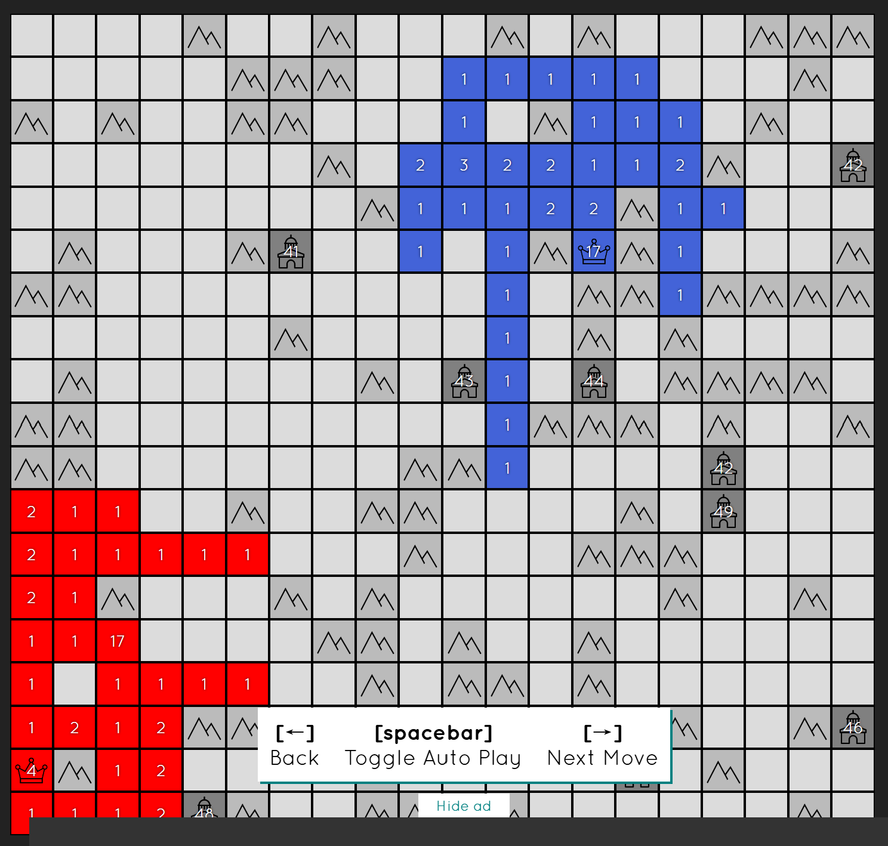

# Generals-io 中期报告

## 项目介绍

### 项目说明
- 项目名称：将军棋
- 开发小组名称：Generals 组
- 开发小组成员：王造时、胡思远、徐若禺

### 项目简介

本项目是对多人在线策略塔防游戏[将军棋](http://generals.io/)的复刻，玩家可以在本地进行人机游戏，也可通过局域网联机对战。

游戏在一块大小为 $n \times m$ 棋盘上进行，其中有四种格子：基地、障碍、要塞和空地。
- 基地：每名玩家有一座初始基地，一旦被其他玩家占领，该玩家出局
- 障碍：不可被经过，也不可被占有
- 要塞：初始时不被任何玩家占有且拥有若干兵力，可以被玩家占领，占领后开始产出兵力
- 空地：可以被玩家占领

玩家可以操纵自己的兵力来占领空地和要塞，以及攻打其他玩家的领地。若玩家的基地被攻占，则该玩家被淘汰。最终存活的玩家游戏胜利。

  

## 项目目标

### 基本目标

- 实现游戏地图的随机生成
- 实现游戏的基本操作
- 实现图形界面的即时显示
- 实现离线人机对战（即实现游戏 bot）
- 实现自定义地图功能

### 进阶目标

- 实现对局回放功能
- 丰富游戏模式与地图元素
- 实现多人局域网联机对战

## 开发进度

第一轮迭代已完成
### 第一轮迭代

- [x] 地图随机生成
- [x] 游戏基本操作
- [x] 图形界面显示

### 第二轮迭代

- [x] 实时排行榜和公告栏的显示
- [ ] 支持用户操作快捷键
- [ ] 离线人机对战
- [ ] 自定义地图功能

### 第三轮迭代

- [ ] 对局回放功能
- [ ] 丰富游戏模式
- [ ] 多人局域网联机对战

### 说明
在实际开发中，我们发现“多人联机”这一功能实现难度较大。在经过充分考量以及与老师的沟通后，我们决定将这一功能作为本项目的进阶需求。相应地，我们对第二轮迭代的目标做了一些调整，使得项目开发的规划更加合理。

## 技术难点

### 随机地图生成算法
为了减少游戏的重复性，也就是尽可能地保证每一次游戏的地图都不相同，选择一个合适的随机地图生成算法是至关重要的。

同时，我们为了保证地图上的内容都是尽可能有效的（不存在无法到达的空地），我们制定了随机生成地图的基本要求：
- 将山区和要塞视为不可走的点时，生成的地图中的空地联通
- 地图包括至少 \(16\) 个空地

在实际算法中，我们先接收用户输入的地图尺寸，以及要塞和山区的个数。接着，我们随机选择不同的格子，将其类型设置为山区，剩下的格子设置为空地。每次新加入一个山区时，需要判断地图中空地的连通性，由此来判断此次加入的山区是否合法。这样就可以保证最终地图中空地是联通的。接着我们再从刚才生成的山区中随机选择若干个作为要塞即可。

### 首都分配机制
为了保证玩家的游戏体验，我们制定了以下要求：在最优的情况下，玩家可以在不经过其他玩家的领地的前提下到达所有的空地。换句话讲，也就是在不经过其他玩家的首都的前提下能够到达所有的空地。

如果将所有的空地都视为一个结点，并在相邻的空地之间连边（四连通）。则上述要求可以转化为：选择的所有首都都不能是这张图的割点。

寻找一张图的所有割点可以使用 $Tarjan$ 算法。但为了简化算法的实现，我们在保证了上述要求的前提下，选择了一个更为简单的算法。

我们只需要找到那些一定不可能是割点的空地来作为首都的候选点即可。接着，我们再在这些候选点中随机挑选首都即可。需要注意的是，我们还需要保证首都之间不能太近，此处我们设置首都之间的曼哈顿距离不小于 $5$。

### 按钮响应问题

### 服务器联机

### MVVM 框架搭建
我们在搭建 MVVM 框架时遇到了不少问题。在项目开发的前期，我们对框架中各层之间关系的理解存在一些问题，导致不同层级之间存在耦合，开发的效率也比较低下。比如，我们没有正确地认识到数据绑定的作用，而是在 View 层中直接调用了 ViewModel 层来获取游戏信息。但实际上，View 层与 ViewModel 层应该是感受不到彼此的存在的，这样才能保证并行开发。而数据绑定使得 View 和 ViewModel 之间的通信更加简洁和高效。例如，玩家的资源、单位数量和地图状态都可以通过数据绑定实时更新UI。

后来，在与老师多次的交流沟通之后，我们才正确地认识到了 View 层和 ViewModel 层的关系，并逐步地解决了代码耦合的问题。在后续的开发中，我们也发现在正确实现这一框架后，游戏操作的添加也会变得更加便捷，也深刻地体会到了框架式开发的重要意义。

## 协作情况
成员之间通过 Github 进行协作开发。根据事先安排好的分工，我们为每个成员新建分支来完成相应的工作，大家都在自己对应的分支进行代码的提交。由于 MVVM 框架的特性，各个成员之间的工作并不需要相互等待，也不会产生冲突，这极大地提高了协作开发的效率。

在项目开发过程中，组长负责协调组员之间的协作，负责各个分支的合并工作，并在发生合并冲突时及时解决。

  

### 部分代码提交记录

  

  

  

## 部分效果图

### 开始界面

  

### 游戏界面
随机地图生成、排行榜和公告栏显示

  

### 游戏进程
- 玩家操作：鼠标单击选择当前单元格，WASD操纵兵力的转移，并可以选择转移全部兵力或一半兵力（之后还会完善撤销、清除等玩家操作）
- 地图更新：（1）根据玩家的移动操作更新地图的显示（2）每固定时间间隔增加单元格上的兵力
- 排行榜更新：获取地图信息，动态更新玩家的排名并显示（以兵力为第一关键字，领地数量为第二关键字）

  

## 个人心得

**王造时：**
本项目源于我们在高中时接触到的一款网络联机小游戏 Generals-io，当时在机房局域网联机这一游戏的时光给我带来了很多快乐。借本课程的契机，同时也考虑到该游戏的界面和规则设计并不是很复杂，我们便选择这一游戏作为开发项目。稍有遗憾的是，我们暂时没有能力实现网络联机的功能，所以我们选择开发一个人机作战的版本。
在项目开发中，我主要负责Common层和App层的开发工作。MVVM 不仅帮助我们实现了代码的高可维护性和可测试性，还使得游戏的开发过程更加高效和结构化。尽管在实现过程中遇到了一些挑战，但通过团队的努力和对架构的深入理解，我们成功地解决了这些问题。这个项目不仅让我在技术上有了很大的提升，也让我对软件架构设计有了更深刻的认识。

**胡思远：**

**徐若禺：**

## 总体心得

通过上学期数据库系统课程的 $MiniSQL$ 大作业，我们对C++的项目管理已经有了一定的了解和掌握，但对于软件开发的架构模式并没有太多的认识。以前完成的项目往往都是模块化的设计，实现的也都是偏后端的内容（类似于MVVM中的Model层）。

而经过本课程的学习，我们了解到了不同的软件架构模式，并尝试将 MVVM 这一框架应用到实际的项目开发中。MVVM 架构通过将数据逻辑、业务逻辑与用户界面分离，项目的代码结构更加清晰，维护和扩展变得更加容易。Model负责处理游戏数据和规则，View负责显示游戏界面，ViewModel则作为桥梁协调两者。这种清晰的职责分工使得我们能够更好地管理和扩展代码。

但在实际的项目开发中，我们搭建这一框架的过程并不顺利。在项目开发的前期，我们对框架中各层之间关系的理解存在一些问题，导致不同层级之间存在耦合，开发的效率也比较低下，同时在添加操作时也发现比较麻烦。后来，在与老师多次的交流沟通之后，我们才正确地认识到了 View 层和 ViewModel 层的关系，并逐步地解决了代码耦合的问题。在后续的开发中，我们也发现在正确实现这一框架后，游戏操作的添加也会变得更加便捷，也深刻地体会到了框架式开发的重要意义。

总的来说，此次课程学习和项目开发的经历让我们受益匪浅，不仅了解到了软件开发的过程，同时也锻炼了我们团队协作的能力。唯一有些遗憾的是，“服务器联机”的功能由于技术水平有限而无法实现。希望在下学期学习过网络部分的知识后，我们能够补充完善这一功能。