

    

         
        
    

         
    

        
	

              
    <b>Generals </b>
    <b>项目成果与总结</b>
     
     
    <table style="border:none;text-align:center;width:72%;font-family:仿宋;font-size:14px; margin: 0 auto;">
    <tbody style="font-family:华文宋体;font-size:12pt;">
    	<tr style="font-weight:normal;"> 
    		<td style="width:20%;text-align:right;">授课教师</td>
    		<td style="width:2%">：</td> 
    		<td style="width:40%;font-weight:normal;border-bottom: 1px solid;text-align:center;font-family:华文仿宋"> 袁昕 </td>     </tr>
    	<tr style="font-weight:normal;"> 
    		<td style="width:20%;text-align:right;">组长</td>
    		<td style="width:2%">：</td> 
    		<td style="width:40%;font-weight:normal;border-bottom: 1px solid;text-align:center;font-family:华文仿宋"> 王造时</td>     </tr>
    	<tr style="font-weight:normal;"> 
    		<td style="width:20%;text-align:right;">组员</td>
    		<td style="width:2%">：</td> 
    		<td style="width:40%;font-weight:normal;border-bottom: 1px solid;text-align:center;font-family:华文仿宋"> 胡思远</td>     </tr>
    	<tr style="font-weight:normal;"> 
    		<td style="width:20%;text-align:right;"></td>
    		<td style="width:2%"></td> 
    		<td style="width:40%;font-weight:normal;border-bottom: 1px solid;text-align:center;font-family:华文仿宋"> 徐若禺</td>     </tr>
    	<tr style="font-weight:normal;"> 
    		<td style="width:20%;text-align:right;">日期</td>
    		<td style="width:2%">：</td> 
    		<td style="width:40%;font-weight:normal;border-bottom: 1px solid;text-align:center;font-family:华文仿宋"> 2024.7.13</td>     </tr>
    </tbody>              
    </table>

## 项目介绍

### 项目说明

- 项目名称：将军棋
- 开发小组名称：Generals 组
- 开发小组成员：王造时、胡思远、徐若禺

### 项目简介

本项目是对多人在线策略塔防游戏[将军棋](http://generals.io/)的复刻，玩家可以在本地自定义地图元素、玩家数量与游戏模式，并进行人机对战。游戏结束后，玩家还可以观看对局回放。

 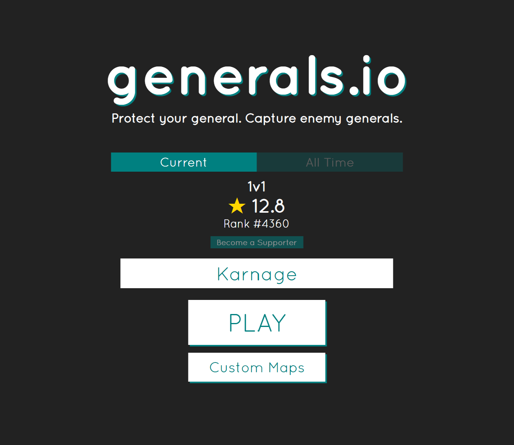 

 Generals.io 游戏网站截图 

### 游戏规则简述

#### 游戏地图

游戏在一块大小为 $n \times m$ 棋盘上进行，其中有四种格子：基地、障碍、要塞和空地。
- 基地：每名玩家有一座初始基地，一旦被其他玩家占领，该玩家出局
- 障碍：不可被经过，也不可被占有
- 要塞：初始时不被任何玩家占有且拥有若干兵力，可以被玩家占领，占领后开始产出兵力
- 空地：可以被玩家占领

除了障碍外，每个格子都可以被一名玩家**占有**，玩家所占有的格子中可以驻扎一定单位的**兵力**。

#### 游戏操作与进程

游戏开始时，每名玩家占有一座基地与 1 单位兵力。

游戏以**回合**为单位进行。每个回合，玩家可以移动自己所占有格子中的兵力到相邻格子中。如果目标格子已被该玩家占有，则进行兵力叠加；若不被该玩家占有，则进行兵力抵消，若抵消后该玩家兵力为正，则**占领**目标格子。

若玩家 A 的基地被玩家 B 占领，则玩家 A 立即出局。同时，该基地变为玩家 B 的要塞，该玩家占有的其他所有格子的兵力会减半并归玩家 B 所有。

当场上只剩一名玩家时，游戏结束，该玩家获胜。

#### 兵力产出

每个**游戏回合**开始时，玩家占有的**基地**和**要塞**会产出 1 单位兵力。

每隔 25 个游戏回合（即第 25, 50, 75, ... 回合），玩家占有的**空地**会产出 1 单位兵力。基地和要塞不会叠加产生。

#### 可见信息

每名玩家游戏中可以获得的公开信息如下：
- 当前回合数
- 每名存活玩家的总兵力与占领格子数
- 自己占领的格子上的兵力
- 与自己占领格子八连通的格子状态

对于其他不可见格子，若该格子是障碍物/要塞，则该格子被标记为**不可见的障碍物**，否则被标记为**不可见的空地**。

 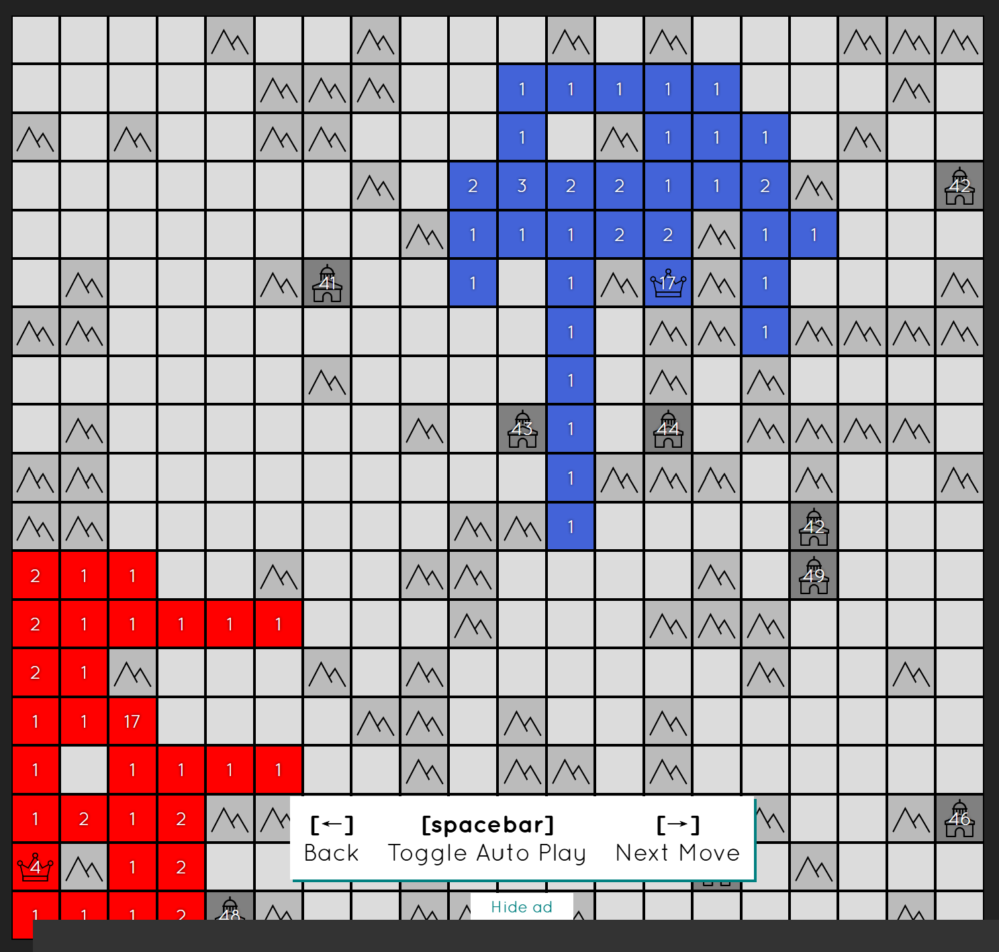 

 Generals.io 游戏网站截图 

## 项目成果

### 开始界面

在开始界面中，玩家可以输入自己的昵称，然后点击 `Ready` 按钮开始游戏。由于本项目并没有实现服务器联机对战，因此 `Server Address` 与 `Connect` 按钮并没有实际功能。

 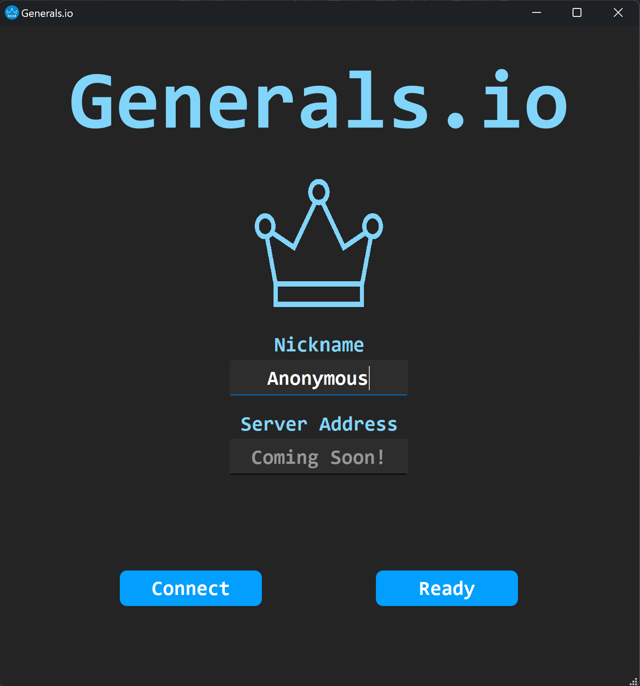 

### 游戏设置界面

在游戏设置界面中，玩家可以对游戏的若干选项进行自定义设置。如果勾选 `Random Map` 选项，则程序会随机生成大小在 16~25 之间的地图；否则，玩家可以手动输入地图大小，并在左侧地图中进行自定义编辑（在单元格中鼠标单击表示要塞，再单击表示障碍）。同时，玩家也可以自己输入 Bot 数量。除此之外，游戏也提供不同模式供玩家选择：

| 模式 | 介绍 |
| --- | --- |
| Misty Veil | 默认模式，地图有战争迷雾（见「游戏规则简述」） |
| Crystal Clear | 移除战争迷雾，地图所有玩家互相可见 |
| Silent War | 移除游戏界面右边的排行榜与公告栏 |
| Leap Frog | 玩家 A 占领玩家 B 基地时，A 的基地迁移至 B |

点击 `Start Game` 按钮后，程序会根据玩家数量随机分配基地，游戏开始。

 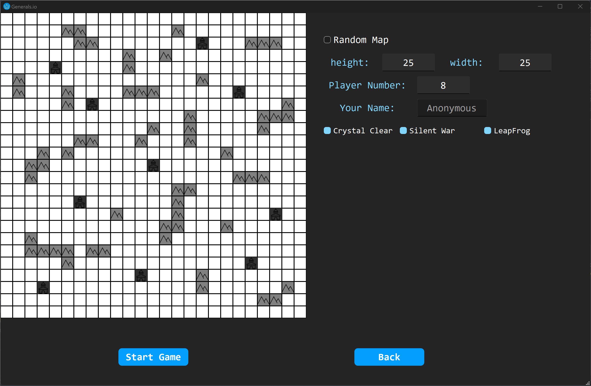 

### 游戏界面

游戏界面的左侧为游戏地图，右侧分别是实时排行榜和公告栏，下方为可供鼠标点击的按钮：
| 按钮 | 介绍 |
| --- | --- |
| Full/Half | 表示每次移动调动该格所有/一半兵力 |
| Undo Move | 从移动序列中移除上一次移动 |
| Clear Move | 清空移动序列 |
| Surrender | 投降认输 |
| Back to Map | 游戏结束后，返回设置界面 |
| Replay | 游戏结束后，观看回放 |

Misty Veil 模式

 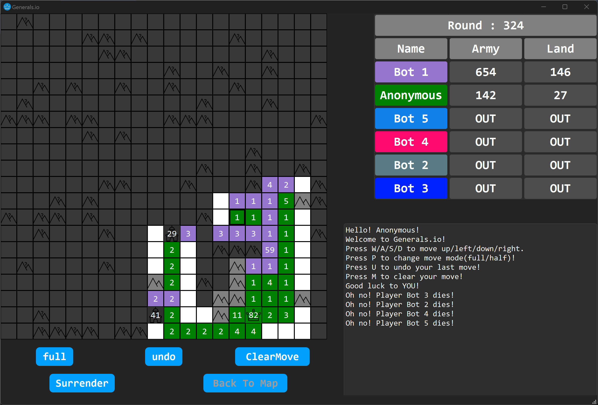 

Crystal Clear 模式

 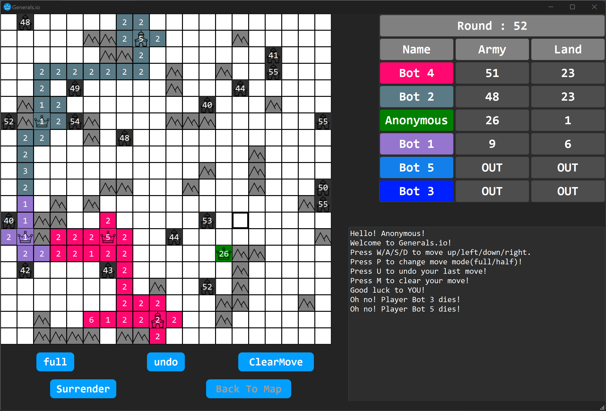 

结算界面（Silent War 模式）

 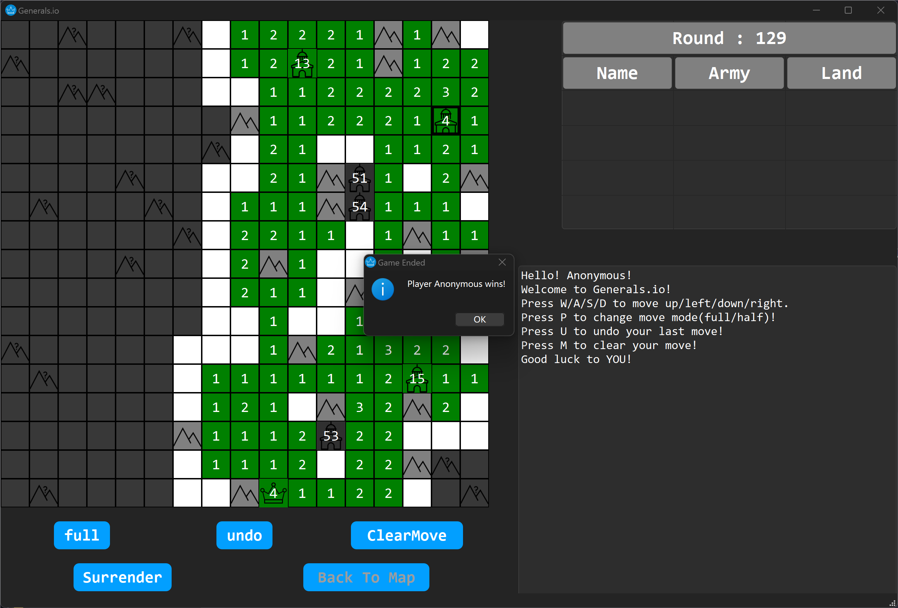 

### 回放界面

进入回放界面后，玩家可以通过自动/单步模式观看回放。

 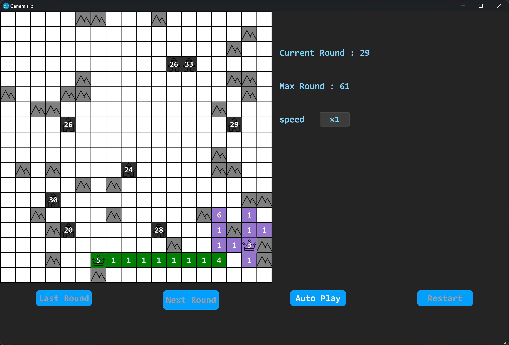 

## 开发协作情况

### 开发规划

**第一轮迭代**
- [x] 地图随机生成
- [x] 游戏基本操作
- [x] 图形界面显示

**第二轮迭代**
- [x] 实时排行榜和公告栏的显示
- [x] 支持用户操作快捷键
- [x] 离线人机对战

**第三轮迭代**
- [x] 自定义地图功能
- [x] 丰富游戏模式
- [x] 对局回放功能

### 工具链使用

- 版本控制：Git/Github
- 开发环境：VS Code/QT Creator
- 编程语言：C++17
- 构建工具：CMake
- 文档编写：Markdown
- 架构模式：MVVM

使用 Github 代码仓库进行代码管理，并在本地使用 Git 进行代码提交。

 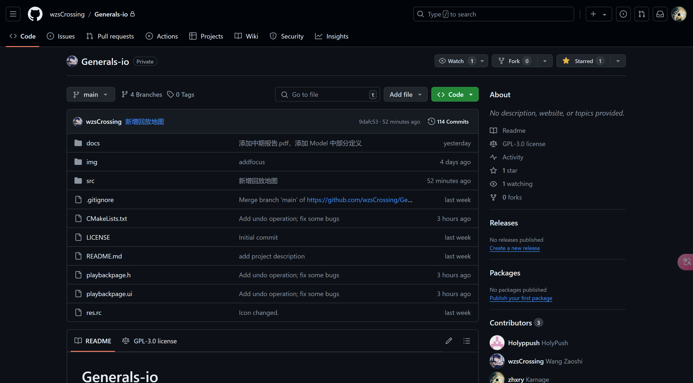 

使用 Visual Studio Code 进行集成开发，并在命令行使用 git 进行代码提交。

  

使用 Qt Creator 进行集成开发，CMake 进行项目构建。

 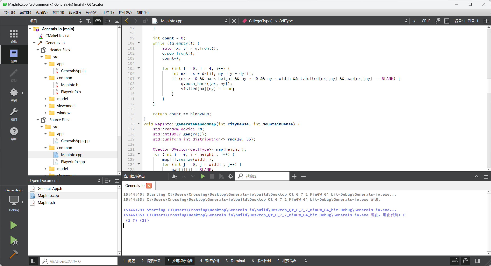 

### 协作情况

成员之间通过 Github 进行协作开发。根据事先安排好的分工，我们为每个成员新建分支来完成相应的工作，大家都在自己对应的分支进行代码的提交。由于 MVVM 框架的特性，各个成员之间的工作并不需要相互等待，也基本不会产生冲突，这极大地提高了协作开发的效率。

|  组员  | 分工 |
| ----- |  - |
| 王造时 | App 层、Common 层 |
| 胡思远 | Window & View 层 |
| 徐若禺 | Model 层、ViewModel 层 |

Github 仓库中的代码提交记录如下：

 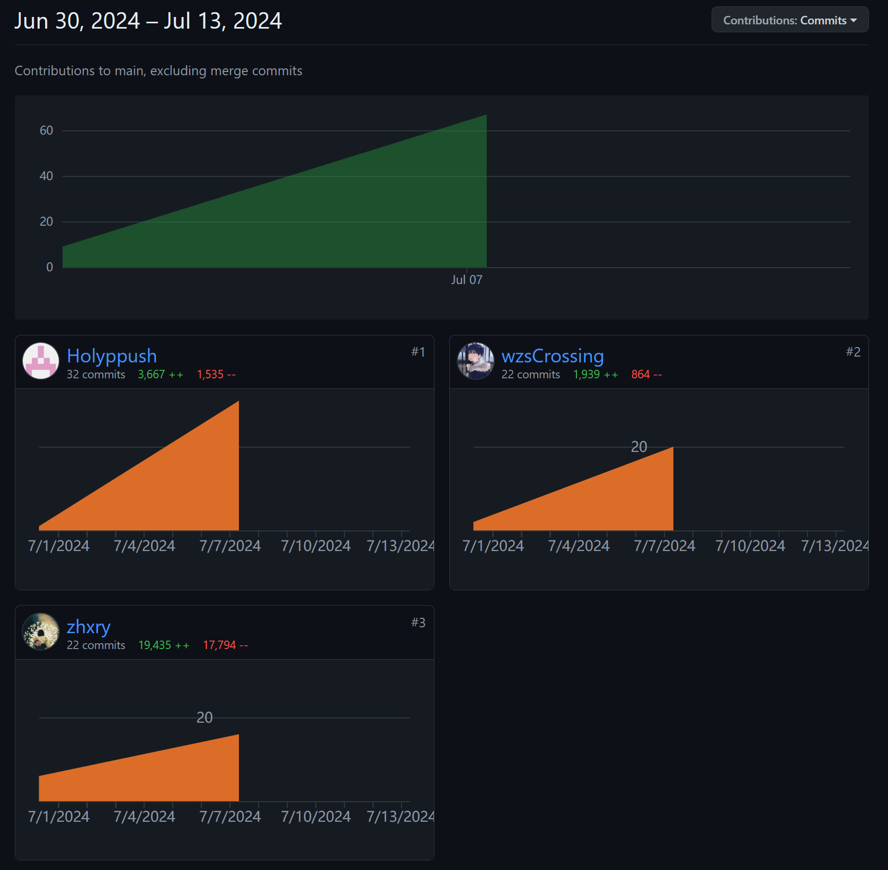 

Github 仓库中的 Pull Request 记录如下：

 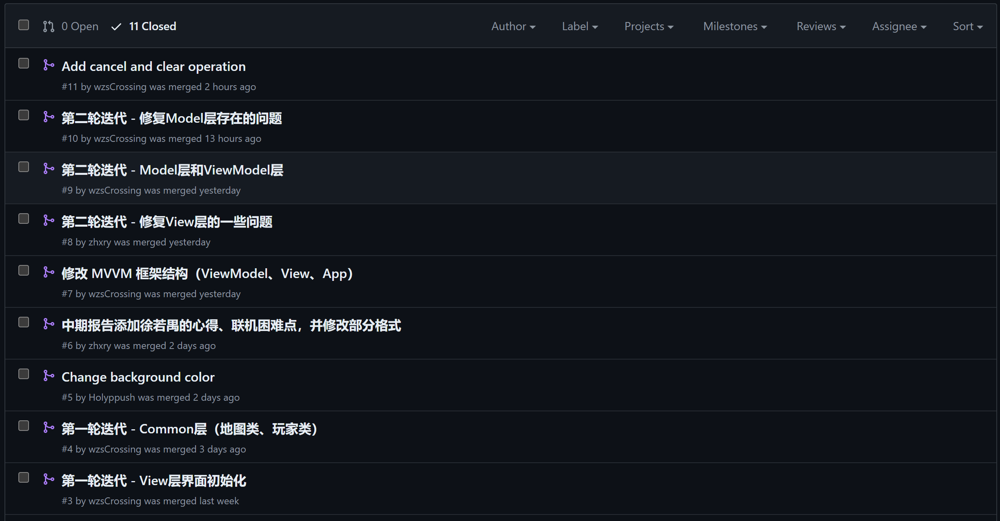 

## 总结与心得

### 项目总结

通过上学期数据库系统课程的 MiniSQL 大作业，我们对 C++ 的项目管理已经有了一定的了解和掌握，但对于软件开发的架构模式并没有太多的认识。以前完成的项目往往都是模块化的设计，实现的也都是偏后端的内容（类似于 MVVM 中的 Model 层）。

而经过本课程的学习，我们了解到了不同的软件架构模式，并尝试将 MVVM 这一框架应用到实际的项目开发中。MVVM 架构通过将数据逻辑、业务逻辑与用户界面分离，项目的代码结构更加清晰，维护和扩展变得更加容易。Model 负责处理游戏数据和规则，View 负责显示游戏界面，ViewModel 则作为桥梁协调两者。这种清晰的职责分工使得我们能够更好地管理和扩展代码。

但在实际的项目开发中，我们搭建这一框架的过程并不顺利。在项目开发的前期，我们对框架中各层之间关系的理解存在一些问题，导致不同层级之间存在耦合，开发的效率也比较低下，同时在添加操作时也发现比较麻烦。后来，在与老师多次的交流沟通之后，我们才正确地认识到了 View 层和 ViewModel 层的关系，并逐步地解决了代码耦合的问题。在后续的开发中，我们也发现在正确实现这一框架后，游戏操作的添加也会变得更加便捷，也深刻地体会到了框架式开发的重要意义。

尽管「局域网联机对战」这一可以大大提升趣味性的核心玩法没能落地，但是除此之外的大部分功能都已基本实现。玩家可以在本地自定义地图元素、玩家数量与游戏模式，并进行人机对战。看到项目最终成果时油然而生的成就感难以用语言描述。

总的来说，此次课程学习和项目开发的经历让我们受益匪浅，不仅了解到了软件开发的过程，同时也锻炼了我们团队协作的能力。唯一有些遗憾的是，“服务器联机”的功能由于技术水平有限而无法实现。希望在下学期学习过网络部分的知识后，我们能够补充完善这一功能。

### 个人心得

**王造时：**

本项目源于我们在高中时接触到的一款网络联机小游戏 Generals-io，当时在机房局域网联机这一游戏的时光给我带来了很多快乐。借本课程的契机，同时也考虑到该游戏的界面和规则设计并不是很复杂，我们便选择这一游戏作为开发项目。稍有遗憾的是，我们暂时没有能力实现网络联机的功能，所以我们选择开发一个人机作战的版本。

在项目开发中，我主要负责 Common 层和 App 层的开发工作。MVVM 不仅帮助我们实现了代码的高可维护性和可测试性，还使得游戏的开发过程更加高效和结构化。尽管在实现过程中遇到了一些挑战，但通过团队的努力和对架构的深入理解，我们成功地解决了这些问题。这个项目不仅让我在技术上有了很大的提升，也让我对软件架构设计有了更深刻的认识。

**胡思远：**

由于我对游戏规则的理解并不是最深入的，并且对图形界面颇有兴趣，因此在项目开发中我主要负责 View 层的工作。在使用 Qt 的过程中，我第一次发觉图形界面的设计是如此方便和神奇（在此之前，我仅在 C 大课程中接触过图形界面，但是使用课程提供的库函数非常麻烦别扭），并且觉得将整个外观掌控在自己手里的感觉非常令人兴奋。虽然设计的过程查阅了不少资料，产生了不少问题，但是整体来看还是非常愉悦的。

但是由于对 MVVM 理解的不到位，我经历了不少次对代码的大规模修改。不过在这个过程当中，我也逐渐一步步理解了这个模式，从对它的质疑变成了接受与认可。在这几天的不断试错之后，我们的工作也进展得更加顺利。

**徐若禺：**

在本项目中，我负责 Model 和 ViewModel 层的编写。我需要根据 Common 层中的基础类在 Model 层中实现游戏的基本逻辑，并在 ViewModel 层中将 Model 层的内容进行整合，为 View 层提供简洁的接口。项目开始的前几天，我在配置带有 Qt 库的 VSCode 环境上耗费了较多的时间，好在最终搭建成功，让后续的编写体验大大提升。

虽然上学期有 OOP 的先修基础，但由于缺乏大型项目的协作编写经验、对 MVVM 框架理解不够深入，我在 Model、ViewModel 两个类的框架搭建过程中迟迟无法推进。不过在多次与同伴讨论、向老师请教之后，我逐渐理解了 MVVM 框架的设计思想，也明白了各个层级之间的关系，最终成功地完成了 Model 和 ViewModel 层的编写。在第一轮迭代对框架进行规范化后，之后进行功能扩展时便无需对现有框架进行较大调整，组员之间的协作效率也大幅提高。经过三轮迭代后，本项目的预期功能基本实现，虽然还有提升的空间，但是第一次协作开发的经历让我受益匪浅。

### 课程建议

在本课程学习的初期，老师对 MVVM 模式进行了一定的介绍，也用一些 Demo 进行举例说明，但这些样例往往较为简单，实际开发中的需求往往并不能很好覆盖。例如，我们组一开始想通过 QWebSocket 实现局域网联机对战的功能，但是互联网上采用 MVVM 框架并结合 QWebSocket 开发的案例少之又少，导致我们不得不在重新评估项目难度与时间成本后放弃了这一目标。希望今后可以提供过往课程的各类优秀作品以便有不同需求的同学参考。

同时，老师也提及开发过程中可能用到的工具链，但是大部分人对其中的很多工具（GitHub Actions, Valgrind 等）并不熟悉，希望以后老师能结合开发案例对这些工具的使用进行介绍。

此外，本课程一开始并没有对重要时间点（项目规划提交时间、中期检查时间等）进行明确的说明，希望今后的课程能够在这方面有所改进。